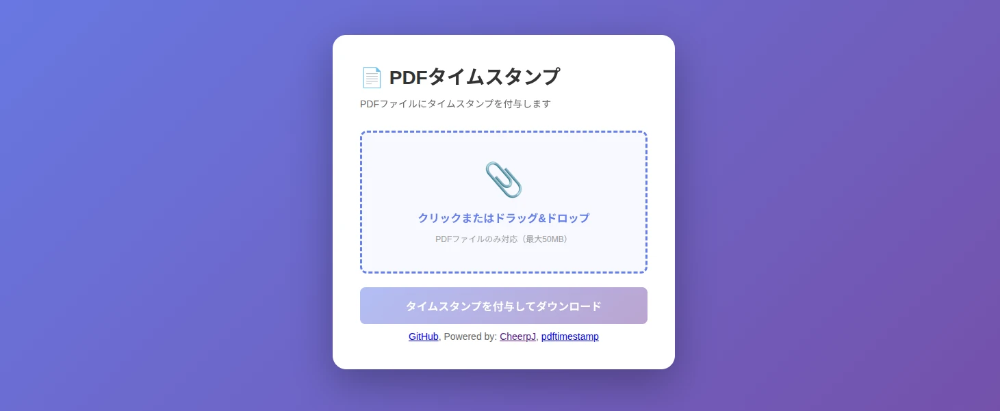

# Online PDF Timestamper: pdftimestamp-web

https://330k.github.io/pdftimestamp-web/

This web application applies LTV-compliant timestamp signatures to the selected PDF file.

Since the signing process is performed on the browser side, the PDF content is not sent over the network. Only hash data is transmitted.

SSL.com (ts.ssl.com) is used as the timestamp server, and its certificate is registered as a default trusted certificate on the operating system.

## References

* [pdftimestamp](https://github.com/akr/pdftimestamp)
* [CheerpJ](https://cheerpj.com/)
